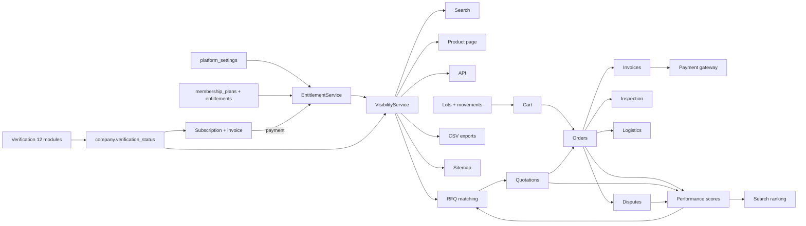

# 01 — Requirements analysis & traceability matrix

## Source availability (read first)

| Source | Status | Consequence |
|---|---|---|
| Google Sheet "BearingCave" (9 tabs) | **Not accessible** from the build environment (Google Docs blocked by network policy; no export was provided). | No spreadsheet row was read. Every requirement below comes from the written master prompt. Spreadsheet-only details (exact wording, extra rows, the real 86 Supplier List headings) are **unverified** and listed in the Client Decisions Register (D-01, D-02). |
| 6 competitor websites | **Not reachable** (DNS failure for every domain). | Competitor notes are limited to third-party public sources — see `02_COMPETITOR_RESEARCH.md`. |

Action for the client: share the sheet as an `.xlsx` export. The traceability rows marked **Sheet?** must then be reconciled (≈ ½ day), and the 86 proposed Supplier Master fields replaced with the real headings (admin → Supplier master data → edit field labels; no code change needed).

## Legend

- **Status**: ✅ implemented and covered by an automated test · ☑ implemented, verified by manual crawl/E2E only · ◐ partial (gap described) · ⏸ pending external integration or business approval (configurable, not activated).
- Tests: `T01`–`T11` = `tests/feature/T*`, `PC` = `PolicyCalculationsTest`, `SML` = `SearchMatchLabelTest`, `U` = unit tests, `E2E` = `tests/e2e/responsive.mjs`, `CRAWL` = 457-page authenticated GET crawl (see testing report).

## 1. Roles (prompt §6)

| # | Requirement | Implementation | Data | Screens / controllers | Test | Status |
|---|---|---|---|---|---|---|
| R1 | Guest visitor | `Viewer::guest()`, `VisibilityService` guest rules | — | Public site (`Web\*`) | T03, T06, E2E | ✅ |
| R2/R3 | Unverified / verified buyer | Shield group `buyer`; verified = company `verification_status=verified` + `buyer_verified` plan entitlements | `companies`, `buyer_profiles`, `subscriptions` | `Buyer\*`, `Account\*` | T04, T07 | ✅ |
| R4/R5 | Unverified / verified supplier | Shield group `supplier`; plan `supplier_free` / `supplier_verified` via `EntitlementService` | `companies`, `supplier_profiles`, `subscriptions` | `Supplier\*` | T01, T02, T10 | ✅ |
| R6 | Company employee, configurable access | `company_members` (owner/admin/member) + `company_member_permissions`; `member:` route filter | `company_members`, `company_member_permissions` | Account → Team | CRAWL (employee login) | ☑ |
| R7–R14 | 8 staff roles | Shield groups + permission matrix (`app/Config/AuthGroups.php`), `permission:` route filters, menu built from permissions | `auth_groups_users` | `Admin\*` | T01, T05, T08, CRAWL (8 staff logins) | ✅ |
| R15 | No cross-company access | `BaseController::owned()` → 404 + security audit event; all buyer/supplier queries scoped by company id | `audit_logs` | all private controllers | T08 | ✅ |

## 2. Supplier membership (§7)

| # | Requirement | Implementation | Data | Screens | Test | Status |
|---|---|---|---|---|---|---|
| M1 | Plan A free / Plan B ₹50,000 per year | `MembershipSeeder`; admin-editable price, duration, entitlements | `membership_plans`, `plan_entitlements` | Admin → Membership plans; Supplier → Membership; public `/membership` | T07 | ✅ (fee approval_status = pending) |
| M2 | Each plan feature/restriction | 23 entitlement keys checked by `EntitlementService::has()`, `entitled:` filter, `entitled()` helper; menu lock icons | `plan_entitlements` | everywhere | T07 (bulk import, per-piece, direct enquiries, buyer badge, buyer analytics), T02, T10 | ✅ |
| M3 | Verification workflow stages, compliance separate from payment | `VerificationService` (stages from setting `verification.supplier_stages`); `MembershipService` creates subscription + invoice only **after** approval; activation on payment | `verification_*`, `subscriptions`, `invoices`, `payments` | Supplier → Verification / Membership; Admin → Verification queue | T01 | ✅ |
| M4 | Membership records, invoices, payments, expiry, renewal reminder, history, suspension/reactivation | `MembershipService::expireDue/sendRenewalReminders`, `bearingcave:daily`; `CompanyService::suspend/reactivate` | `subscriptions`, `invoices`, `payments`, `verification_events`, `audit_logs` | Admin → Subscriptions, Companies | T10, T01 | ✅ |

## 3. Buyers (§8)

| # | Requirement | Implementation | Test | Status |
|---|---|---|---|---|
| B1 | Unverified buyer: browse (restricted), search, RFQ (limit `max_open_rfqs`=5), quotations, orders, inspection, logistics, disputes | `Buyer\*`, `Account\*` controllers | T04, T05, T09 | ✅ |
| B2 | Verified buyer badge, advanced comparison, consolidation eligibility, scores, search analytics | entitlements `buyer_badge`, `advanced_comparison`, `consolidation_services`, `buyer_analytics`; `PerformanceService::computeBuyer` | T07, CRAWL | ✅ |
| B3 | Restricted inventory **not** granted automatically | needs verified status **and** `restricted_inventory_access` entitlement **and** an explicit staff grant (`buyer_profiles.restricted_inventory_access`, permission `verification.approve`) | T06 | ✅ |
| B4 | Structured buyer verification | stages from `verification.buyer_stages` | T07 (buyer verified path) | ✅ |

## 4. Supplier verification — 12 modules (§9)

All modules: form in Supplier/Buyer → Verification, stored in MySQL, reviewed in Admin → Verification queue → application, every decision appended to `verification_events` + `audit_logs`.

| # | Module | Tables | Notes | Test | Status |
|---|---|---|---|---|---|
| V1 | Registration & profile (legal name, address, reg. numbers, directors, contact, categories, bank) | `companies`, `company_directors`, `supplier_profiles`, `kyc_records` | bank account number encrypted | T01 | ✅ |
| V2 | KYC/KYB (GST, PAN, CIN, VAT, TIN, owner, UBO, bank, address) | `kyc_records` | ID numbers encrypted; `kyc.sensitive` permission to view decrypted | T01 | ✅ |
| V3 | Compliance (ISO, IATF 16949, AS9100, RoHS, REACH, ESG, insurance, labour) | `compliance_certifications` + `documents` | expiry → `expired` by daily job | T01 | ✅ |
| V4 | Financial (credit rating, turnover, profitability, balance sheet, bank refs, legal cases, bankruptcy) | `financial_assessments` | | T01 | ✅ |
| V5 | Risk (6 factors, LOW/MEDIUM/HIGH) | `risk_assessments`; `RiskService` | weights & thresholds are settings (**pending approval**) | PC, T01 | ✅ |
| V6 | Quality (PPAP, APQP, FMEA, CAPA, QC, rejection history, certificates) | `quality_assessments` | | T01 | ✅ |
| V7 | Site audit | `site_audits` | recorded by staff; no remote audit tooling | T01 | ✅ |
| V8 | Document management (secure upload, expiry, versions, reminders, comments) | `documents` (`version`, `is_current`, `review_status`, `review_comment`) | private storage, streamed after access check | T01, T08 | ✅ |
| V9 | Approval workflow (multi-stage, assignees, pending, reject, reapply, AVL) | `verification_applications`, `verification_stages` (`assigned_to`) | | T01 | ✅ |
| V10 | Sanctions (UN, OFAC, PEP, AML) | `sanctions_screenings` | **⏸ no provider**: staff record manual results with source + reference; nothing is auto-"cleared" (setting `sanctions.provider=none`) | T01 | ⏸ provider |
| V11 | Performance monitoring (OTD %, rejection %, cost, response time, service level) | `supplier_performance` (computed from orders/RFQs/disputes) | metrics only from stored records; empty when no history | T04 | ✅ |
| V12 | Approved Vendor List (category/brand/product approvals, suspend, reactivate) | `approved_vendors` | used by RFQ matching | T04 | ✅ |

## 5. Catalog, search, inventory (§10, §11)

| # | Requirement | Implementation | Test | Status |
|---|---|---|---|---|
| C1 | All product fields (incl. OEM, cross refs, fitments, specs, dims, tiers, lots, images, docs, inspection status, shipping options, country restrictions) | `products` + `part_numbers`, `cross_references`, `fitments`, `product_specifications`, `pricing_tiers`, `inventory_lots`, `product_images`, `documents`, `product_country_rules` | T02, T03 | ✅ |
| C2 | Search: part no., OEM, cross ref, brand, category, vehicle, specs, dimensions, verified filter, country, price, qty; autocomplete; sort; pagination | `SearchService` (FULLTEXT + normalised part numbers), `/search/suggest` (Fetch API) | T04, E2E | ✅ |
| C3 | Part-number matches must not imply interchangeability | match type label on every result (`match_note()`), cross refs labelled "supplier-declared, not verified" unless `relation=verified_interchange` | SML | ✅ |
| C4 | Inventory age <6 / 6–12 / >12 months with defined boundaries | `InventoryService::ageBucket` / `ageBucketSql` on the oldest open lot's received date *d*: **< 6 months** = *d* after today−6 months; **6–12 months** = today−12 months ≤ *d* ≤ today−6 months (both ends inclusive); **> 12 months** = *d* before today−12 months | U (InventoryAgeTest) | ✅ |
| C5 | Product detail page (gallery, specs, stock, price/RFQ, qty, verification, cart, comparison, inspection, logistics, documents) | `Web\Product::show`, `web/product.php` | E2E | ✅ |
| C6 | Supplier inventory dashboard (add/edit/archive, images, stock, MOQ, prices, countries, publish, enquiries, documents, ageing, reports export) | `Supplier\Products`, `/supplier/products/export` | T02, T03 | ✅ |
| C7 | Bulk upload: template, map, preview, errors, duplicates, confirm; admin on behalf | `ImportService`, `Supplier\Imports`, `Admin\Imports` | T03, E2E (real multipart upload) | ✅ |
| C8 | Accurate movements; no negative stock / overselling | `inventory_movements`, conditional UPDATE, CHECK `chk_products_stock`, FIFO lots | T09, T11 | ✅ |
| C9 | Alternative parts "when genuinely supported" | only supplier-declared cross refs are shown, labelled as such; no inferred alternatives | — | ✅ |

## 6. Supplier master data (§12)

| # | Requirement | Implementation | Status |
|---|---|---|---|
| S1 | Preserve all 86 Supplier List columns, normalised | `supplier_master_fields` (86 field definitions, each mapped to a native table/column or to EAV `supplier_master_attributes`) | ◐ **Sheet?** — the 86 headings are a *proposal* (`is_confirmed=0`) because the sheet was unreadable; admin can relabel/confirm without code changes |
| S2 | Import template + field mapper | `SupplierMasterService`, Admin → Supplier master data (template download, upload, map, preview, confirm) | ☑ CRAWL |
| S3 | No fabricated suppliers; demo clearly marked | `DemoSeeder` creates only `[SAMPLE]` companies with `is_sample=1`, refuses to run in production; "SAMPLE DATA" badge in UI | ✅ |

## 7. Visibility & confidentiality (§13)

| # | Requirement | Implementation | Test | Status |
|---|---|---|---|---|
| X1 | Allowed / excluded countries (product + company level) | `product_country_rules`, `company_country_rules`; `VisibilityService::apply()` (fails closed) | T03 | ✅ |
| X2 | Verified-buyer-only listings | `visibility=verified_buyers` | T06 | ✅ |
| X3 | Hidden supplier identity, confidential bidding, restricted documents, anonymous logistics | `public_alias`, `supplierLabel()`, quotations visible only to the RFQ buyer and admins, document `visibility` (private / platform / verified_buyers / public), logistics mode `confidential` | T06, T04 | ✅ |
| X4 | Enforced in queries, search, detail, API, RFQs, recommendations, exports, cache/indexing | same `VisibilityService` used by `SearchService`, `Product::show`, API, `MatchingService`, related items, CSV exports, `sitemap.xml`; restricted pages send `noindex` + `X-Robots-Tag` | T03, T06, CRAWL | ✅ |

## 8. RFQ, comparison, cart, orders, payments, disputes (§14–§19)

| # | Requirement | Implementation | Test | Status |
|---|---|---|---|---|
| Q1 | Buyer RFQ form (all fields, documents) | `Buyer\Rfqs`, `RfqService::create` | T04 | ✅ |
| Q2 | Workflow submit → admin review → match → distribute → quote → compare → negotiate → accept/reject → order | `RfqService`, `MatchingService` (stored score + reasons), `QuotationService` (revisions, messages), `OrderService::fromQuotation` | T04 | ✅ |
| Q3 | Only verified suppliers with premium leads receive RFQs | eligibility = verified + `premium_rfq_leads` + active | T04 | ✅ |
| K1 | Cart / RFQ basket, quantities, comparison (price, stock, delivery, inspection, verification) | `CartService`, `Web\Compare` (advanced columns gated by `advanced_comparison`) | T02, T09 | ✅ |
| K2 | No fake checkout; orders tied to approved terms | order from cart requires listed price & stock reservation; RFQ orders from accepted quotation; proforma invoice issued; payment via gateway abstraction only | T02, T09 | ✅ |
| I1 | Inspection: in-house 10 % of invoice value; third-party quoted; workflow to report | `InspectionService` (rate from settings; min fee setting **pending**); report upload | T05, PC | ✅ |
| L1 | Logistics: direct, managed, confidential, consolidation, pickup/destination, quote, tracking, documents | `LogisticsService`, `shipments`, `shipment_events` | T06 | ✅ |
| L2 | 10 % managed-logistics charge, configurable base, not auto-applied | setting `logistics.platform_fee_basis` = `manual_quote` (**pending**) — no automatic charge until approved | PC | ⏸ approval |
| O1 | PO, items, terms, proforma, confirmation, payment/shipment/delivery status, history | `orders`, `order_items`, `order_status_history`, `invoices` | T02, T04 | ✅ |
| P1 | Payment abstraction, webhooks, reconciliation, idempotency; no simulated escrow | `PaymentGatewayInterface`, `BankTransferGateway` (manual reconciliation by finance), `SandboxGateway` (non-production, HMAC-signed), `payment_webhook_events` unique key | T01, T02 | ✅ / ⏸ escrow provider |
| D1 | Disputes (categories, order ref, documents, response, assignment, history, resolution, closure) | `DisputeService`, `dispute_messages` | CRAWL | ☑ |

## 9. Dashboards, admin, settings, notifications, reports, SEO, security (§20–§30)

| # | Requirement | Implementation | Test | Status |
|---|---|---|---|---|
| U1 | Buyer dashboard — 17 sections | `nav_helper` buyer menu (all 17 present) | CRAWL, E2E | ☑ |
| U2 | Supplier dashboard — 21 sections, gated by plan | supplier menu with lock icons; `entitled:` filters | T07, CRAWL, E2E | ✅ |
| A1 | Admin modules 1–32 | see mapping table below | CRAWL (8 staff roles) | ☑ |
| A2 | Admin KPIs from real data only | `ReportService::kpis()` (SQL counts; sample records counted separately) | CRAWL | ☑ |
| G1 | Admin-controlled settings (fee, entitlements, verification rules, inspection, logistics, countries, currency, risk, buyer scoring, ranking, notifications, RFQ matching, payments, email, branding) | `platform_settings` (61 keys, each with approval status), Admin → Settings / Membership plans | PC, T07 | ✅ |
| N1 | In-app + email notifications for 13 events; never claim unsent delivery | `NotificationService` → `notifications` + `email_outbox` (status `queued/sent/failed/disabled` recorded from the mailer's real result); `email.delivery_enabled=0` until SMTP approved | T01, T04 | ✅ / ⏸ SMTP |
| N2 | SMS/WhatsApp only if provider approved | settings `notifications.sms_provider/whatsapp_provider=none`; no sender implemented | — | ⏸ provider |
| RP1 | 15 reports with date ranges and CSV/Excel export | `ReportService` (15 SQL reports), `/admin/reports/{key}/export` (CSV, `?format=xlsx`) | CRAWL | ☑ |
| SEO1 | Friendly URLs, titles, meta, canonical, sitemap, robots, structured data, Search Console | `components/head.php` (JSON-LD), `Seo` controller, settings `seo.*`; indexing **off** by default | CRAWL | ☑ |
| SEC1 | Auth, RBAC, CSRF, validation, query builder, hashing, sessions, rate limiting, upload validation, private storage, password reset, audit, isolation, encryption, safe errors | Shield, filters, `ThrottleFilter` (proportional 10 POST/min/IP, no permanent lockout), `DocumentService`, CI encryption | T08, E2E | ✅ |
| SEC2 | Optional MFA | Shield Email-2FA is available but **not enabled** (needs working email) | — | ⏸ D-14 |
| SEC3 | Password recovery | Shield magic-link ("Forgot password?") — requires SMTP to deliver | — | ⏸ SMTP |

### Admin module mapping (prompt §22, 32 modules)

| # | Module | Screen | # | Module | Screen |
|---|---|---|---|---|---|
| 1 | Dashboard | `/admin` | 17 | Quotations | `/admin/quotations` |
| 2 | Users | `/admin/users` | 18 | Orders | `/admin/orders` |
| 3 | Buyers | `/admin/companies?type=buyer` | 19 | Inspection | `/admin/inspections` |
| 4 | Suppliers | `/admin/companies?type=supplier` | 20 | Logistics | `/admin/logistics` |
| 5 | Staff & Roles | `/admin/staff` | 21 | Payment Records | `/admin/payments`, `/admin/invoices` |
| 6 | Company Verification | `/admin/verifications` | 22 | Escrow Integration | `/admin/webhooks` (gateway events) + settings `payments.*` — provider ⏸ |
| 7 | Supplier KYC | verification application → KYC tab | 23 | Membership Plans | `/admin/memberships` |
| 8 | Supplier Compliance | verification application → Compliance tab | 24 | Supplier Subscriptions | `/admin/subscriptions` |
| 9 | Approved Vendor List | `/admin/avl` | 25 | Performance Scores | `/admin/performance` |
| 10 | Categories | `/admin/categories` | 26 | Disputes | `/admin/disputes` |
| 11 | Brands | `/admin/brands` | 27 | Reports & Analytics | `/admin/reports` |
| 12 | Product Catalog | `/admin/products` | 28 | CMS | `/admin/cms` |
| 13 | Inventory Management | `/admin/inventory`, `/admin/imports` | 29 | SEO Settings | `/admin/seo` |
| 14 | RFQ Management | `/admin/rfqs` | 30 | Notifications | `/admin/notifications` (outbox) |
| 15 | Supplier Matching | RFQ detail → matches (re-run, invite) | 31 | Platform Settings | `/admin/settings` |
| 16 | Bidding | RFQ detail → quotations & revisions | 32 | Audit Logs | `/admin/audit` |

## 10. Feature dependency analysis

Implications: verification must exist before paid membership; entitlements gate features but never verification; any new channel that lists products must call `VisibilityService::apply()`.
