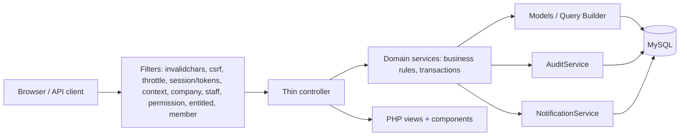
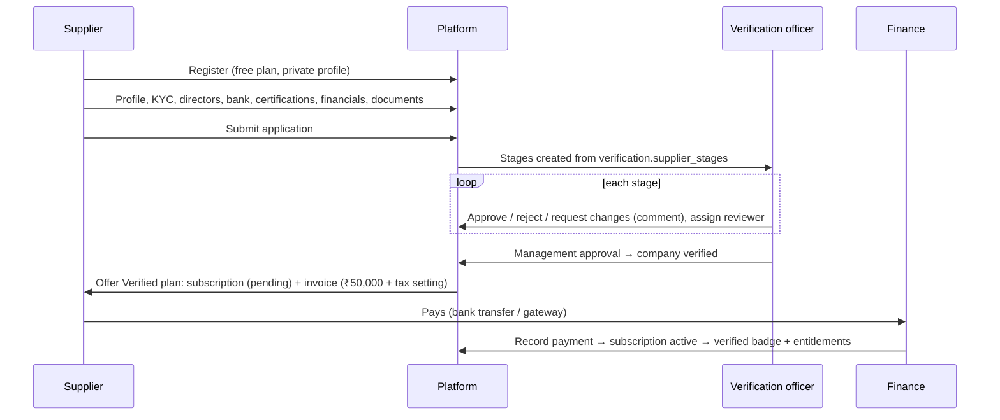
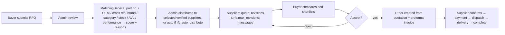

# 03 — Architecture, module map & workflows

## Stack

| Layer | Choice |
|---|---|
| Framework | CodeIgniter 4.7 (appstarter), PHP 8.2+ (`declare(strict_types=1)` everywhere) |
| Database | MySQL 8 (InnoDB, utf8mb4_unicode_ci, strict mode, CHECK constraints, FULLTEXT) |
| Auth | CodeIgniter Shield 1.4: sessions, access tokens for the API, groups and permissions |
| UI | Server-rendered PHP views, Bootstrap 5.3.3, Bootstrap Icons, Inter font. All self-hosted under `public/assets/vendor`, so there are no CDN calls. |
| JS | One file of vanilla JS (`public/assets/js/app.js`, Fetch API): autocomplete, confirm dialogs, form repeaters, fee estimates, mobile sidebar |
| Spreadsheets | PhpSpreadsheet (import of CSV/XLSX/XLS, XLSX templates and exports) |

There is no Node backend, front-end framework or CDN dependency. Node and Playwright are used only for the optional E2E test script.

## Request flow

- **Controllers** only validate input, call a service and render or redirect. `BaseController::attempt()` turns a `BusinessRuleException` into a flash error and keeps the form input.
- **Services** (`app/Services`, resolved through `service('name')` in `app/Config/Services.php`) hold every business rule. Multi-table changes run in explicit transactions. The DB config sets `transException=true`, so a failing SQL statement always rolls back.
- **Policy** values come from `platform_settings` through `policy('key')`, and plan features come from `EntitlementService`. No controller hard-codes a price, percentage or plan.

## Module map

| Module | Services | Main controllers |
|---|---|---|
| Identity & companies | `CompanyService`, `CompanyContext`, `EntitlementService` | `Web\Register`, `Account\Profile`, `Account\Team`, `Admin\Users`, `Admin\Staff`, `Admin\Companies` |
| Verification (12 modules) | `VerificationService`, `RiskService`, `DocumentService`, `SupplierMasterService` | `Account\Verification`, `Account\Documents`, `Admin\Verifications`, `Admin\Avl`, `Admin\SupplierMaster` |
| Membership & billing | `MembershipService`, `BillingService`, `Libraries\Payments\*` | `Supplier\Membership`, `Account\Billing`, `Admin\Memberships`, `Admin\Payments`, `Api\Webhooks` |
| Catalog & search | `ProductService`, `SearchService`, `VisibilityService`, `RankingService` | `Web\Catalog`, `Web\Product`, `Web\Compare`, `Web\Suppliers`, `Supplier\Products`, `Admin\Products`, `Admin\Categories`, `Admin\Brands` |
| Inventory | `InventoryService`, `ImportService` | `Supplier\Products` (lots), `Supplier\Imports`, `Admin\Inventory`, `Admin\Imports` |
| Procurement | `RfqService`, `MatchingService`, `QuotationService`, `CartService`, `OrderService` | `Buyer\Rfqs`, `Buyer\Cart`, `Buyer\Orders`, `Supplier\Rfqs`, `Supplier\Orders`, `Admin\Rfqs`, `Admin\Orders` |
| Services | `InspectionService`, `LogisticsService`, `DisputeService` | `Account\Inspections`, `Account\Logistics`, `Account\Disputes`, matching `Admin\*` |
| Platform | `SettingsService`, `NotificationService`, `AuditService`, `ReportService`, `PerformanceService`, `NumberGenerator` | `Admin\Settings`, `Admin\Reports`, `Admin\Performance`, `Admin\Cms`, `Admin\Outbox`, `Admin\Audit`, `Web\Seo` |
| API | same services | `Api\V1\*` (see `API.md`) |
| CLI | — | `bearingcave:create-admin`, `bearingcave:daily`, `bearingcave:outbox` |

## Key design decisions

1. **One visibility choke point.** `VisibilityService::apply()` adds every listing restriction: published status, active company, verified-buyer-only listings, allow/deny countries at product and company level, and hidden listings. Search, product pages, the API, related items, RFQ matching, exports and the sitemap all call it. Unknown buyer countries fail closed.
2. **Verification and payment are separate.** `companies.verification_status` is set only by staff stage decisions. The paid `supplier_verified` plan is offered only after approval and activates when the invoice is paid. Entitlements resolve from the active subscription's date range, so expiry takes effect immediately even if the daily job has not run.
3. **Inventory integrity.**
   - Reservations use `UPDATE products SET stock_reserved = stock_reserved + ? WHERE id = ? AND stock_on_hand - stock_reserved >= ?`, and success is checked through affected rows.
   - The CHECK constraint `chk_products_stock` is the last line of defence.
   - Dispatch consumes lots FIFO, and every change writes an `inventory_movements` row.
   - TEST 9 and TEST 11 prove this, including with parallel processes.
4. **Honest money flows.** `PaymentGatewayInterface` has two implementations:
   - `BankTransferGateway`: finance records a payment against a bank reference.
   - `SandboxGateway`: refuses to run in production and is labelled as sandbox in the UI.

   Webhooks are verified by HMAC and are idempotent through `payment_webhook_events`. No escrow is simulated.
5. **Honest notifications.** Every email goes through `email_outbox`. The status becomes `sent` only when the mailer returns success. If delivery is disabled the status is `disabled`, and the UI never says "email sent".
6. **Sensitive data.**
   - Bank account and ID numbers are encrypted with CI Encryption (key in `.env`). Only staff with `kyc.sensitive` see them decrypted.
   - Documents live in `writable/uploads/private`, which is outside the webroot, and are streamed only after `DocumentService::canAccess()`.
7. **Audit.** `AuditService` logs business events and security events. Examples are cross-company access attempts, permission denials and settings changes. Each entry records the actor, IP, entity and before/after values where relevant.

## Workflows

### Supplier onboarding and verification (TEST 1)

A reviewer can either request changes (the supplier edits and resubmits) or reject. After a rejection the supplier can **reapply**, which opens a new application cycle. History is kept in `verification_events`.

### RFQ to order (TEST 4)

### Order lifecycle

`pending_supplier_confirmation → confirmed → awaiting_payment → paid → in_fulfilment → shipped → delivered → completed`, with `cancelled` (a reason is required) and `disputed` as side states. Allowed transitions and who may make them are defined in `OrderService::TRANSITIONS`. Every transition writes `order_status_history`. Cancelling an order releases its stock reservations through `InventoryService::release()`.

### Inspection (TEST 5)

Request (with order/invoice value) → quote (in-house = `inspection.in_house_rate_pct` % of the invoice value, never below `inspection.in_house_min_fee`; third-party = manual quote) → buyer accepts → inspector assigned → in progress → report and evidence uploaded (pass/fail/partial) → completed. A product's inspection status changes only from a stored report.

### Logistics (TEST 6)

Request (mode: supplier direct / platform managed / confidential / consolidation; pickup; destination; packages) → quote (manual until `logistics.platform_fee_basis` is approved) → accepted → shipment with tracking events → delivered. In confidential mode, the buyer never sees the supplier's name or pickup address.

### Bulk import (TEST 3)

Upload (CSV/XLSX, at most `imports.max_rows` rows) → automatic column mapping (editable) → validation per row (required fields, category/brand lookup, condition, dates, numbers, countries, duplicate SKUs in the file and in the database) → preview with errors → confirm → products created with an opening lot and movement → optionally submitted for review.

### Disputes

Raised against an order (category, description, documents) → the other party responds → staff assign, investigate and add internal or shared messages → resolution note → closed. Every step is recorded in `dispute_messages` and `audit_logs`.
