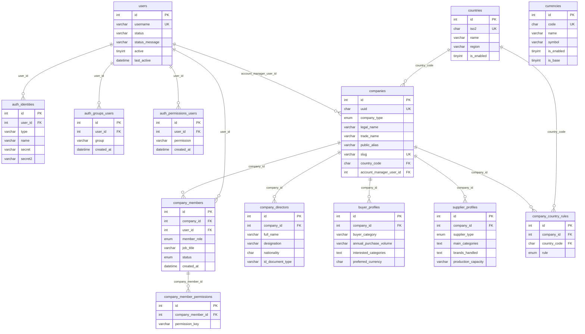
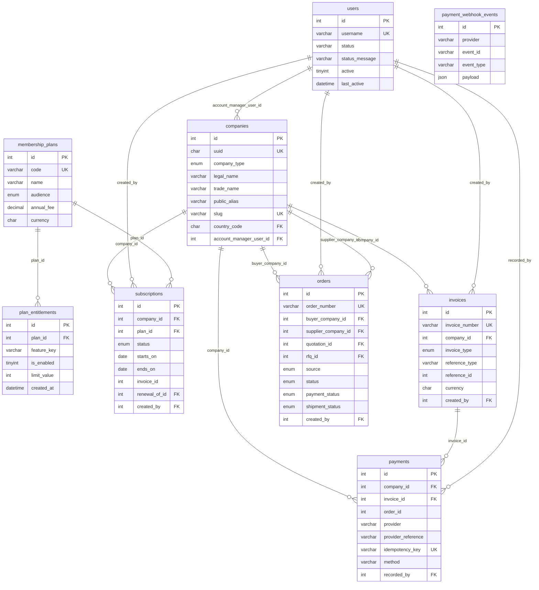
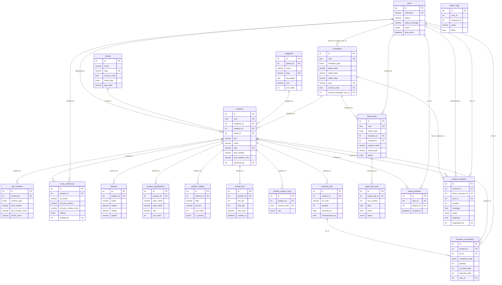
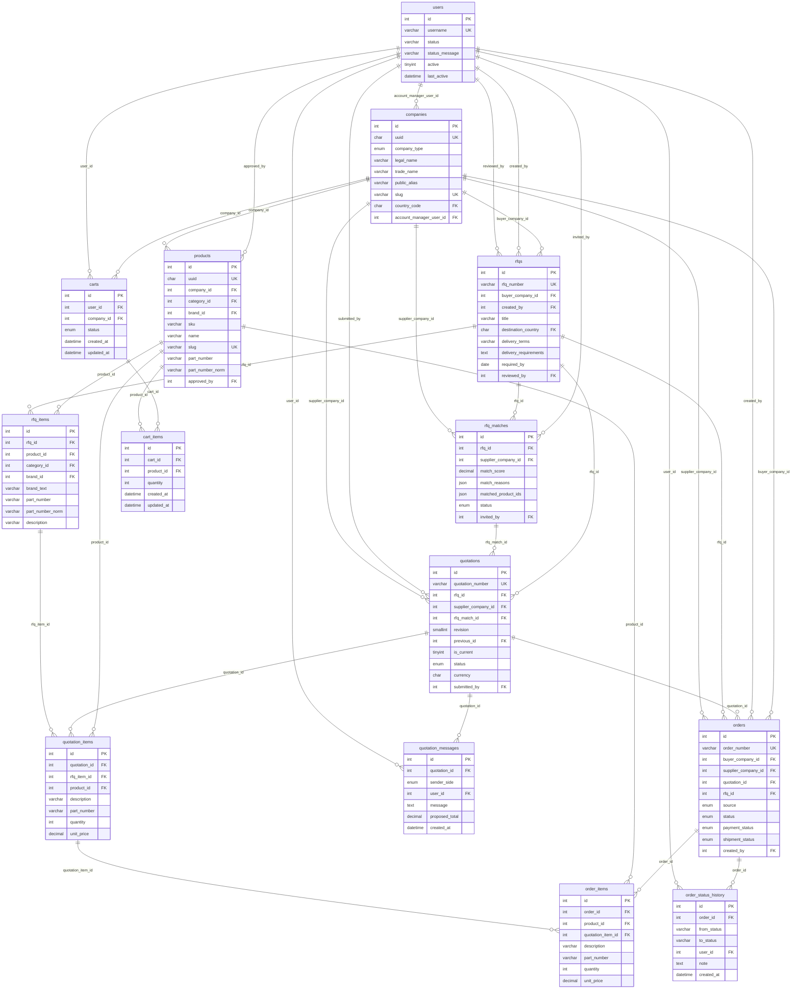
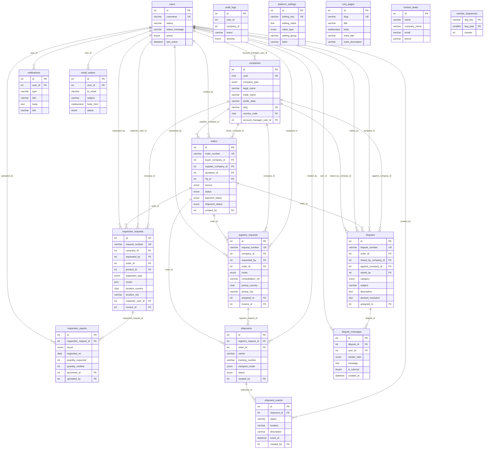

# Entity–relationship diagram

Generated from the live MySQL schema (`information_schema`) after running all migrations — not hand-drawn — so it matches the code. Regenerate after schema changes with `DB_PASS=… python3 tools/er_diagram.py`.

Tables: 81 · foreign keys: 146. Shield auth tables (`auth_*`) are owned by CodeIgniter Shield.

## Identity & companies

## Verification (12 modules)

```mermaid
erDiagram
    companies {
        int id PK
        char uuid UK
        enum company_type
        varchar legal_name
        varchar trade_name
        varchar public_alias
        varchar slug UK
        char country_code FK
        int account_manager_user_id FK
    }
    users {
        int id PK
        varchar username UK
        varchar status
        varchar status_message
        tinyint active
        datetime last_active
    }
    verification_applications {
        int id PK
        int company_id FK
        enum application_type
        smallint cycle
        enum status
        varchar current_stage
        int decided_by FK
    }
    verification_stages {
        int id PK
        int application_id FK
        varchar stage_key
        smallint sort_order
        enum status
        int assigned_to FK
        int reviewed_by FK
        datetime reviewed_at
    }
    verification_events {
        int id PK
        int application_id FK
        varchar stage_key
        varchar action
        int user_id FK
        text notes
        datetime created_at
    }
    kyc_records {
        int id PK
        int company_id FK
        varchar gst_number
        varchar pan_number
        varchar cin_number
        varchar vat_number
        int reviewed_by FK
    }
    compliance_certifications {
        int id PK
        int company_id FK
        enum cert_type
        varchar cert_name
        varchar cert_number
        varchar issuer
        int document_id FK
        int reviewed_by FK
    }
    financial_assessments {
        int id PK
        int company_id FK
        varchar fiscal_year
        char currency
        decimal annual_turnover
        decimal net_profit
        int reviewed_by FK
    }
    risk_assessments {
        int id PK
        int company_id FK
        int application_id FK
        tinyint financial_risk
        tinyint operational_risk
        tinyint compliance_risk
        tinyint geographic_risk
        int assessed_by FK
    }
    quality_assessments {
        int id PK
        int company_id FK
        tinyint has_inspection_system
        enum ppap
        enum apqp
        enum fmea
        int reviewed_by FK
    }
    site_audits {
        int id PK
        int company_id FK
        date scheduled_on
        date conducted_on
        int auditor_user_id FK
        varchar external_auditor
        text site_address
        int report_document_id FK
    }
    sanctions_screenings {
        int id PK
        int company_id FK
        enum subject_type
        varchar subject_name
        varchar provider
        varchar lists_checked
        int screened_by FK
    }
    approved_vendors {
        int id PK
        int company_id FK
        enum scope_type
        int scope_id
        enum status
        date valid_until
        int approved_by FK
    }
    supplier_performance {
        int id PK
        int company_id FK
        date period_start
        date period_end
        int orders_count
        decimal on_time_delivery_pct
    }
    documents {
        int id PK
        char uuid UK
        int company_id FK
        int uploaded_by FK
        varchar entity_type
        int entity_id
        varchar doc_type
        varchar title
        int previous_version_id FK
        int reviewed_by FK
    }
    supplier_master_fields {
        int id PK
        varchar source_heading
        varchar field_key UK
        varchar field_group
        varchar target
        enum data_type
    }
    supplier_master_attributes {
        int id PK
        int company_id FK
        varchar field_key
        text value
        int import_job_id
        datetime created_at
    }
    categories {
        int id PK
        int parent_id FK
        varchar name
        varchar slug UK
        text description
        varchar icon
        int sort_order
    }
    brands {
        int id PK
        varchar name
        varchar slug UK
        char country_code
        enum brand_type
        varchar logo_path
    }
    products {
        int id PK
        char uuid UK
        int company_id FK
        int category_id FK
        int brand_id FK
        varchar sku
        varchar name
        varchar slug UK
        varchar part_number
        varchar part_number_norm
        int approved_by FK
    }
    users ||--o{ approved_vendors : "approved_by"
    companies ||--o{ approved_vendors : "company_id"
    users ||--o{ companies : "account_manager_user_id"
    companies ||--o{ compliance_certifications : "company_id"
    documents ||--o{ compliance_certifications : "document_id"
    users ||--o{ compliance_certifications : "reviewed_by"
    companies ||--o{ documents : "company_id"
    users ||--o{ documents : "reviewed_by"
    users ||--o{ documents : "uploaded_by"
    companies ||--o{ financial_assessments : "company_id"
    users ||--o{ financial_assessments : "reviewed_by"
    companies ||--o{ kyc_records : "company_id"
    users ||--o{ kyc_records : "reviewed_by"
    users ||--o{ products : "approved_by"
    brands ||--o{ products : "brand_id"
    categories ||--o{ products : "category_id"
    companies ||--o{ products : "company_id"
    companies ||--o{ quality_assessments : "company_id"
    users ||--o{ quality_assessments : "reviewed_by"
    verification_applications ||--o{ risk_assessments : "application_id"
    users ||--o{ risk_assessments : "assessed_by"
    companies ||--o{ risk_assessments : "company_id"
    companies ||--o{ sanctions_screenings : "company_id"
    users ||--o{ sanctions_screenings : "screened_by"
    users ||--o{ site_audits : "auditor_user_id"
    companies ||--o{ site_audits : "company_id"
    documents ||--o{ site_audits : "report_document_id"
    companies ||--o{ supplier_master_attributes : "company_id"
    companies ||--o{ supplier_performance : "company_id"
    companies ||--o{ verification_applications : "company_id"
    users ||--o{ verification_applications : "decided_by"
    verification_applications ||--o{ verification_events : "application_id"
    users ||--o{ verification_events : "user_id"
    verification_applications ||--o{ verification_stages : "application_id"
    users ||--o{ verification_stages : "assigned_to"
    users ||--o{ verification_stages : "reviewed_by"
```

## Membership & billing

## Catalog & inventory

## Procurement & orders

## Services, disputes & platform

## Critical relationships

- **companies** is the tenant boundary. Every buyer/supplier record (products, RFQs, quotations, orders, documents, verification) carries a `company_id` / `*_company_id`; controllers load private records through `BaseController::owned()` which 404s and writes a security audit event on mismatch.
- **company_members** links Shield `users` to companies with a member role (owner/admin/member) and **company_member_permissions** grants employees granular rights (`App\Libraries\CompanyPermissions`).
- **products → inventory_lots → inventory_movements**: stock is received in dated lots (inventory age = oldest open lot), every change writes a movement row; `products.stock_on_hand/stock_reserved` are denormalised counters protected by CHECK constraint `chk_products_stock` and conditional UPDATEs (no overselling).
- **part_numbers / cross_references / fitments** hold normalised part numbers, supplier-declared cross references (`relation` distinguishes declared vs verified interchange) and vehicle applications.
- **product_country_rules / company_country_rules** implement allow/deny country visibility; `VisibilityService` is the single enforcement point used by web, search, API, RFQ matching, exports and sitemap.
- **rfqs → rfq_items → rfq_matches → quotations → quotation_items**: matches store score + reasons; quotations are per supplier with revision numbers; acceptance creates an **orders** row with **order_items**.
- **orders → invoices → payments**: proforma invoices and payments are separate; **payment_webhook_events** enforces idempotency (unique provider + event id).
- **membership_plans → plan_entitlements**, **subscriptions** (date-ranged) determine features via `EntitlementService`; verification status lives on `companies`, independent of payment.
- **verification_applications → verification_stages → verification_events**: one application per company, one row per configured stage, append-only event history.
- **supplier_master_fields / supplier_master_attributes**: the 86 Supplier List headings are field definitions (EAV for headings without a native column); headings that map to native tables (KYC, certifications, risk, etc.) are written there.
