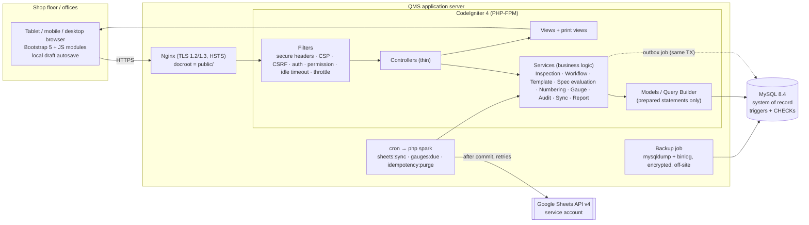
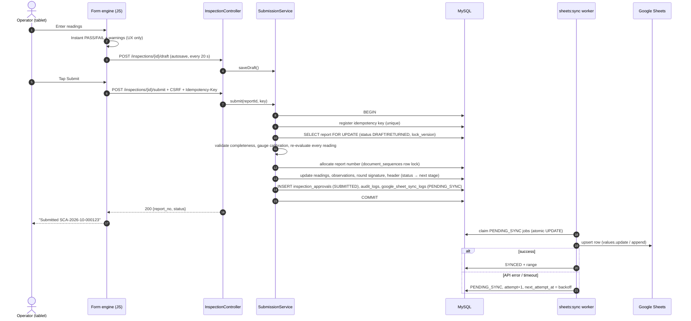

# 1. Project architecture

> Paperless Quality Inspection System (QMS) for a manufacturing plant.
> Status: **architecture for approval** — no application code is generated until this is signed off.

## 1.1 Scope

Operators open the QMS on a shop-floor tablet, log in, pick the **report type, part, machine and shift**, and the
system loads the matching **inspection template**. They enter readings, which are checked against LSL/USL as they
type, and submit. After that:

1. The data is stored in **MySQL first**, in one transaction. MySQL is the system of record.
2. The data is **copied to an authorised Google Spreadsheet** asynchronously, with retries. Sheets is for reporting only.
3. The report goes through **Production → Quality → QA approval**, with an e-signature at each stage.
4. Anyone allowed can **print an A4 sheet** that looks like the current paper format.
5. Management gets **dashboards and daily / weekly / monthly reports**.
6. **Every action is recorded** in an append-only audit trail.

Report types delivered first: **A. Setup Change Approval (SCA)**, **B. Product Parameter Inspection (PPI)**,
**C. In-Process Inspection Report (IPR)**. New report types are configuration (report type + template), not code,
as long as they fit one of the three layouts below.

## 1.2 Technology stack

| Concern | Choice | Version (Oct 2026) | Notes |
|---|---|---|---|
| Language | PHP | 8.2+ (8.3 recommended) | `intl`, `mbstring`, `mysqlnd`, `curl`, `gd`, `sodium`, `opcache` |
| Framework | CodeIgniter 4 | 4.7.x (requires PHP ^8.2) | MVC + Services, Query Builder, Filters, CSRF, Validation, Migrations, Spark CLI |
| Database | MySQL | **8.4 LTS** (8.0.16+ minimum; 8.0 reached EOL in April 2026) | InnoDB, utf8mb4, CHECK constraints, triggers, JSON |
| UI | Bootstrap 5 + Bootstrap Icons | 5.3.8 / 1.13 | Served locally from `public/assets/vendor` (installed with Composer packages `twbs/bootstrap`, `twbs/bootstrap-icons`), so no CDN and no Node.js |
| JavaScript | Vanilla ES2020 modules | – | Small modules: form engine, live validation, autosave/offline queue. No SPA framework |
| Google integration | `google/apiclient` (Sheets v4 only) | 2.20.x | Composer `extra.google/apiclient-services: ["Sheets"]` strips the other ~200 services |
| PDF | mPDF | 8.3.x | Server-side PDF download / archive. Browser printing uses the same HTML with `@media print` |
| Tests | PHPUnit + CI4 test tools | PHPUnit 10.5+ | `CIUnitTestCase`, `DatabaseTestTrait`, `FeatureTestTrait`, run against a MySQL test database |
| Web server | Nginx + PHP-FPM | – | Document root = `public/` only. Apache + `.htaccess` is supported as an alternative |

Not used, as instructed: WordPress, Laravel, a Node.js backend.

## 1.3 Key architecture decisions

| # | Decision | Why |
|---|---|---|
| D1 | **MySQL is the only system of record. Google Sheets sync uses a transactional outbox.** The sync job row is written in the same DB transaction as the submission. A cron worker pushes it to Sheets after commit. | A report cannot exist without its sync job, and Google being down can never block or lose an inspection. |
| D2 | **Templates are data, are versioned, and are immutable once published.** A spec change means a new template version. Every report points at the exact version it was inspected against, and each observation also keeps a copy of LSL/USL. | No inspection parameter is hard-coded. Historical reports keep the specification they were judged against (traceability). |
| D3 | **One storage model covers all three layouts.** `report → rounds → observations → readings`. A *round* is one inspection time. SCA/PPI have exactly one round. IPR has one round per shift × inspection time. | One engine for entry, validation, printing and reporting; new report types need no schema change. |
| D4 | **The server decides PASS/FAIL.** The browser shows results instantly for usability, but the service recomputes every result using exact decimal comparison, inclusive limits. | Client-side validation is never trusted. |
| D5 | **The database itself enforces the critical integrity rules**, not only the application code: CHECK constraints, composite FKs, a unique published version per template, and triggers that freeze submitted data and make audit/approval/calibration history append-only. The application DB account also has no DELETE/UPDATE privilege on evidence tables. | Defence in depth. Even an application bug or a misused DB account cannot silently change an approved inspection or delete audit history. Verified by `database/verify/verify_schema.php` (112 checks). |
| D6 | **Workflow is a fixed state machine with configurable stages per report type.** Production / Quality / QA stages can each be switched on or off. Status values name the stage the report is waiting for (`PENDING_QUALITY` …). | The status is unambiguous even if the configuration changes while reports are in flight. |
| D7 | **Corrections create revisions, never edits.** An approved report is final. A revision (same report number, Rev +1) copies it, goes through the full workflow, and on approval supersedes the original. The original stays intact and printable. | Requirement: approved reports cannot be edited and originals must be kept. |
| D8 | **Custom authentication on CI4 primitives** (`password_hash` with Argon2id, CI4 session/CSRF/Throttler), not CodeIgniter Shield. | The requested schema needs DB-managed roles and permissions, employee linkage, account lockout and login logs, which Shield does not model the same way. The auth surface is small and fully tested. |
| D9 | **Server-rendered pages plus small JS modules.** No SPA. | Fast on low-end tablets, simple to secure (CSP without `unsafe-inline`), works with CI4 views and CSRF, and keeps the project maintainable by a PHP team. |
| D10 | **All DATETIME values are UTC.** Plant time zone (setting) is used for display, "today" and shift detection. `inspection_date` is the *production date* (a night shift belongs to the day it started). | Correct ordering and reporting across midnight shifts and daylight-saving changes. |
| D11 | **Idempotent writes.** A tablet-generated `client_uuid` per inspection plus an `Idempotency-Key` per submit/approve request. | Prevents duplicate reports and double submissions after a network drop or a double tap. |

## 1.4 Logical architecture



### Layer responsibilities

| Layer | Lives in | Responsibility | Must not |
|---|---|---|---|
| Filters | `app/Filters` | Authentication, permission check per route, idle/absolute session timeout, forced password change, CSRF, security headers, rate limiting, no-cache for authenticated pages | Contain business rules |
| Controllers | `app/Controllers` | Read the request, call **one** service method, choose the response (view / JSON / redirect / file) | Query the DB directly, compute results, open transactions |
| Services | `app/Services` | Business rules, transactions, authorization of *records* (ownership, workflow stage), audit entries, outbox jobs | Read `$_POST` / render HTML |
| Validation | `app/Validation` | Rule sets per form plus custom rules (`decimal_places`, `uuid`, `production_date_window` …) | Be the only defence (services re-check invariants) |
| Models / Entities | `app/Models`, `app/Entities` | Persistence through the Query Builder, casts, allowed fields | Hold workflow logic |
| Infrastructure | `app/Libraries` | Google Sheets adapter, PDF renderer, file storage | Leak vendor types into services (interfaces only) |
| Views | `app/Views` | HTML with `esc()` on every variable, layouts, print layouts | Contain queries or permission logic beyond showing or hiding buttons |
| JavaScript | `public/assets/js` | Form engine, instant PASS/FAIL display, autosave, offline queue, idempotency keys | Be trusted for validation or authorization |

## 1.5 Main use case: submitting an inspection



## 1.6 Transactions and concurrency

| Operation | Transaction contents | Concurrency control |
|---|---|---|
| Create inspection | report + rounds (+ empty observation rows) + audit | `client_uuid` unique → a retry returns the existing draft. IPR day sheet: `SELECT … FOR UPDATE` on the machine row, then check for an open sheet for the same part/machine/date |
| Save draft (autosave) | changed readings/observations only (cells the user touched) + audit diff | Report must be DRAFT/RETURNED (also enforced by trigger). Header saves use `lock_version` (optimistic locking → HTTP 409 with merge prompt) |
| Sign / verify IPR round | round status + signer + audit | Round row lock; the signer must not be the operator (CHECK) |
| Submit | as in the sequence above | Idempotency key, report row lock, sequence row lock (gap-free numbering) |
| Verify / approve / return / reject | report status (+ approved_at/by) + approval signature + audit + outbox job | Report row lock, expected `from_status`, idempotency key, segregation-of-duties check |
| Create revision | new report + copied rounds/observations/readings + approval (REVISION_CREATED) + audit | Lock on the original, only one open revision per report number (unique `report_no, revision_no`) |
| Approve revision | revision → QA_APPROVED + `is_current = 1` **in the same statement**, then original → SUPERSEDED | Both rows locked in id order to avoid deadlocks |
| Sheets sync | no business transaction; job status updates only | Atomic claim `UPDATE … WHERE sync_status = 'PENDING_SYNC'`, single worker via `flock`, stale-lock recovery after 10 min |

Rules that apply everywhere:
- Never call an external API (Google) inside a DB transaction.
- Services open transactions with `$db->transException(true)->transStart()` so any failure rolls back and is raised to the controller.
- Deadlocks (`1213`) and lock-wait timeouts (`1205`) are retried up to three times by a `TransactionRunner` helper.

## 1.7 Dates, times and shifts

- MySQL runs with `default_time_zone = '+00:00'`. CI4 runs with `appTimezone = 'UTC'`.
- The plant time zone (`regional.timezone`, default `Asia/Kolkata`) is used to compute "now", the current shift and the production date, and for display and printing.
- Shift detection: shift C 22:00–06:00 crosses midnight. At 02:00 on 4 Oct the default production date is **3 Oct, shift C**.
- `inspection.max_backdate_days` (default 1) limits back-dating. Future dates are rejected.

## 1.8 Error handling and logging

- Production: `CI_ENVIRONMENT=production`, `display_errors=0`, generic error pages (403/404/409/419/429/500) with a **reference ID** that matches the log line.
- Every request gets a `request_id` (16 random bytes, hex). It appears in logs and audit rows and is sent back as `X-Request-Id`.
- Database integrity errors are translated into user messages: `QMS-LOCK` → "This record is locked", `1062` → "Already exists", `3819` → validation message. Raw SQL errors are never shown.
- Logs are kept in `writable/logs` (rotated, 90 days) and optionally shipped to syslog/journald. Credentials and personal data are never logged.

## 1.9 Configuration and environments

| Environment | `CI_ENVIRONMENT` | Database | Notes |
|---|---|---|---|
| Development | `development` | local MySQL 8.4 | Debug toolbar on, demo data seeder |
| Testing | `testing` | dedicated test DB, recreated by migrations | Google client replaced by a fake |
| Production | `production` | dedicated server/socket, `qms_app` account | HTTPS only, `forceGlobalSecureRequests = true`, OPcache with `validate_timestamps = 0` |

Configuration comes from **environment variables** (PHP-FPM pool `env[...]`, or a `.env` file one level above
`public/`, mode `0640`, never committed). Business settings (company name, prefixes, workflow stages, session
timeout …) live in `system_settings` and are edited in the UI by the Super Admin.

## 1.10 Deployment topology

```
                 LAN / VPN (Wi-Fi tablets)
                           │ HTTPS 443
                ┌──────────▼───────────┐
                │ Ubuntu 24.04 LTS     │
                │ Nginx → PHP-FPM 8.3  │  /var/www/qms/releases/<ts>  (current → symlink)
                │ cron: spark jobs     │  /var/www/qms/shared/{writable,.env}
                │ MySQL 8.4 (socket)   │  /etc/qms/secrets/google-sa.json (0440)
                └──────────┬───────────┘
                           │ encrypted backups (daily dump + binlog)
                    ┌──────▼──────┐
                    │ Off-site /  │
                    │ backup host │
                    └─────────────┘
```

- **Start:** one server. This is enough for about 200 concurrent users and several million readings per year.
- **Scale path:** move MySQL to its own host (TLS, `REQUIRE SSL`), add a second PHP node (DB session store already supports it), and add a read replica for heavy reports.
- **Deploys** are atomic (release folders + symlink switch), run `php spark migrate` with the migrator account, then `php spark optimize`, then reload PHP-FPM.

## 1.11 Non-functional targets

| Attribute | Target |
|---|---|
| Form save (autosave) | < 300 ms p95 on plant LAN |
| Page load on a mid-range Android tablet | < 2 s first load, < 1 s afterwards (cached assets) |
| Availability | Plant hours 24×6. Planned maintenance outside shifts |
| Data loss | RPO ≤ 15 min (binlog), RTO ≤ 2 h (restore runbook). Inspection data is never lost because of Google outages |
| Retention | Inspection records, signatures and audit trail are never deleted by the application. Archival follows the customer / IATF retention policy |
| Accessibility | WCAG 2.1 AA contrast, ≥ 48 px touch targets, status never shown by colour alone |
