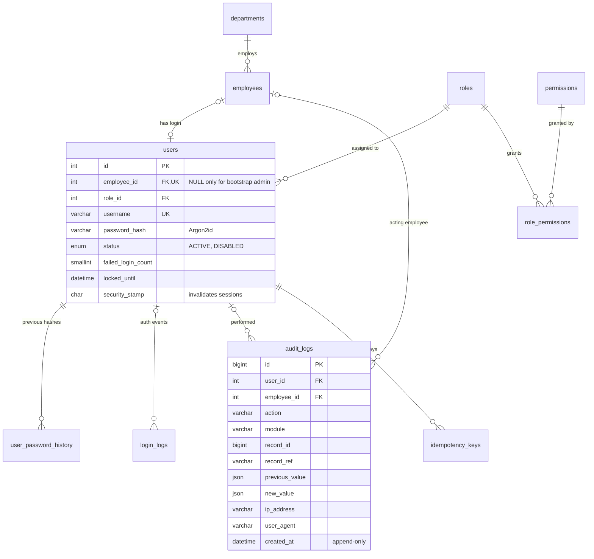
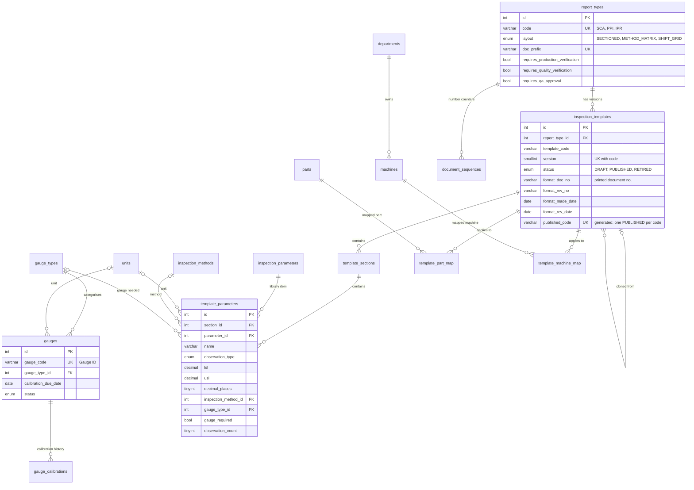
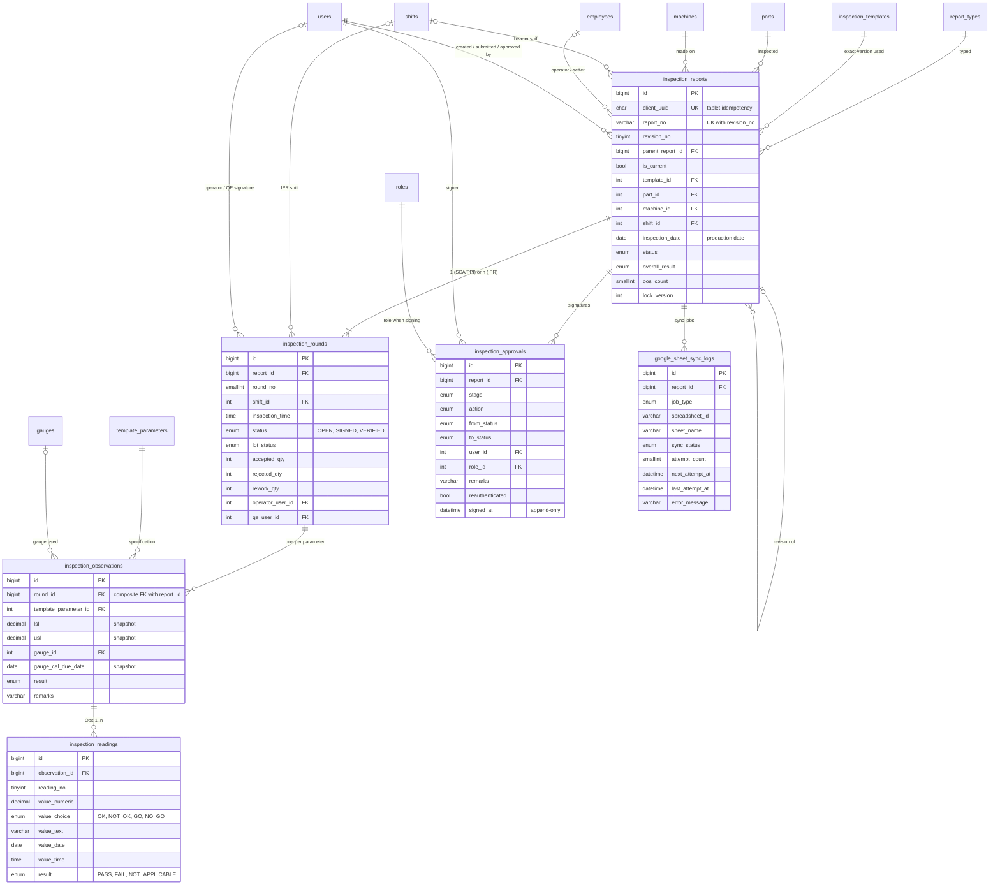

# 3. Database ER diagram

34 tables in four groups. The diagrams render on GitHub (Mermaid). Cardinality notation: `||` exactly one,
`|o` zero or one, `o{` zero or many, `|{` one or many.

## 3.1 Identity, access control and logs



`system_settings` (key/value) and `ci_sessions` (CI4 session store) have no relationships.

## 3.2 Master data and templates



## 3.3 Inspection transactions



## 3.4 The inspection aggregate

```text
inspection_reports            header: type, template version, part, machine, (shift), production date,
│                             status, report_no + revision, overall result, OOS count
├── inspection_rounds         SCA/PPI: exactly 1 round
│   │                         IPR: one per Shift A/B/C x inspection time, with lot status,
│   │                         accepted / rejected / rework, operator + QE e-signatures
│   └── inspection_observations   one per template parameter in that round:
│       │                         gauge used (+ calibration snapshot), LSL/USL snapshot, remarks, result
│       └── inspection_readings   Observation 1 … n, one typed value each, PASS / FAIL / N.A.
├── inspection_approvals      append-only signature history (submit, verify, approve, return, reject …)
└── google_sheet_sync_logs    outbox: one job per sheet write, retried until SYNCED
```

## 3.5 How the paper sheets map to the tables

| Paper field | Stored in |
|---|---|
| **A. Setup Change Approval** | |
| Machine Number / Part Name / Part Number | `inspection_reports.machine_id` → `machines.machine_code`; `part_id` → `parts.part_number`, `part_name` |
| Shift / Date | `inspection_reports.shift_id`, `inspection_date` |
| Received Time / Finish Time | `inspection_reports.received_at`, `finish_at` |
| Sections (Operator Readiness, Machine Readiness, Process Parameters, Other Parameters) | `template_sections` of the SCA template |
| Parameter Name / LSL / USL / Inspection Method / Gauge-Instrument | `template_parameters.name`, `lsl`, `usl`, `inspection_method_id`, `gauge_type_id` (LSL/USL also snapshotted in `inspection_observations`) |
| Gauge ID / Remarks | `inspection_observations.gauge_id`, `remarks` |
| Observation 1 / Observation 2 | `inspection_readings.reading_no = 1 / 2` |
| Skill Level, PM Due Date | readings pre-filled from `employees.skill_level` and `machines.pm_due_date` (`prefill_source`) |
| **B. Product Parameter Inspection** | |
| Part Number / Machine / Date / Shift / Operator / Setter | `inspection_reports` header (`operator_employee_id`, `setter_employee_id`) |
| GO / NO GO · Visual · TPG · DVC columns | `template_parameters.inspection_method_id`. The print shows a tick in that method's column |
| Production Engineer / Quality Engineer / Operator / QA Approval | `inspection_approvals` (SUBMISSION, PRODUCTION_VERIFICATION, QUALITY_VERIFICATION, QA_APPROVAL) |
| **C. In-Process Inspection Report** | |
| Part Number / Machine Name / Date | `inspection_reports` header (no header shift) |
| Shift A / B / C, multiple inspection times | `inspection_rounds.shift_id`, `inspection_time`, `round_no` |
| Observation per parameter per time | `inspection_observations` (round × parameter) + `inspection_readings` |
| Lot Status / Accepted / Rejected / Rework | `inspection_rounds.lot_status`, `accepted_qty`, `rejected_qty`, `rework_qty` |
| Inspected By Operator / Quality Engineer | `inspection_rounds.operator_user_id` / `qe_user_id` with timestamps (e-signatures) |
| **All printed reports** | |
| Company logo / name / address | `system_settings` (`company.*`) |
| Document Number / Revision Number / Make Date / Revision Date | `inspection_templates.format_doc_no`, `format_rev_no`, `format_made_date`, `format_rev_date` (document control of the format) |
| Report number and report revision | `inspection_reports.report_no` + `revision_no` (e.g. `SCA-2026-10-000123 / Rev 1`) |
