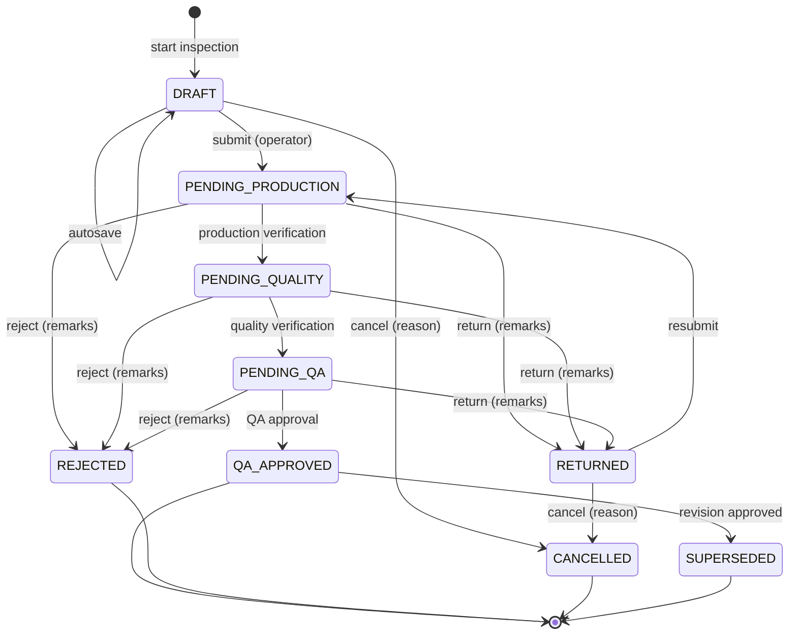
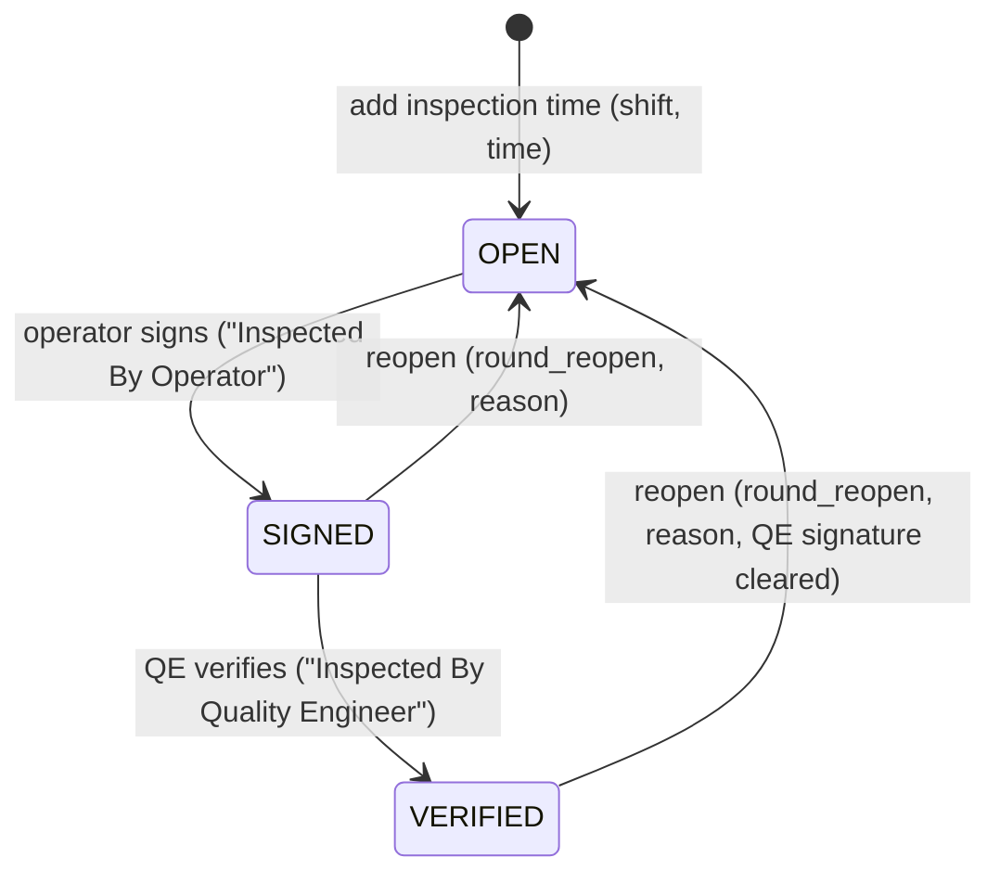

# 7. Workflow

## 7.1 Report state machine



This is the user-requested chain
**Draft → Submitted by Operator → Production Verification → Quality Verification → QA Approved**,
drawn with all three stages switched on. Each `PENDING_*` status names the stage the report is **waiting for**.

### Configurable stages ("Approval workflow" setting)
Each report type switches its stages on or off (`report_types.requires_*`, at least one must stay on).
Defaults: SCA and PPI use all three stages. IPR skips Production Verification.

```
next(after) = first enabled stage after `after` in [PRODUCTION, QUALITY, QA]   → PENDING_<stage>
              or QA_APPROVED when no enabled stage is left
```

Example for IPR: `DRAFT → submit → PENDING_QUALITY → PENDING_QA → QA_APPROVED`. Changing the configuration does not
move reports that are already in flight. The next transition uses the configuration in force at that moment.

## 7.2 Transitions

| # | From | Action | To | Who | Conditions | Side effects (same transaction) |
|---|---|---|---|---|---|---|
| 1 | – | Start | `DRAFT` | `inspection.create` | Published template resolved for type + part + machine; production date within the back-dating window; IPR: if a DRAFT sheet exists for part + machine + date it is opened instead | Report + round(s) + empty observations, pre-fills (skill level, PM due date); audit `CREATE` |
| 2 | `DRAFT` / `RETURNED` | Save draft | same | creator / originator | `lock_version` matches (else 409 + reload prompt); cells only | Readings, results, audit diff |
| 3 | `DRAFT` / `RETURNED` | Submit | `next(SUBMISSION)` | `inspection.submit`, creator (IPR: any operator of the sheet) | All mandatory readings present; required gauge IDs given; gauge ACTIVE and calibrated on the date (blocking if `gauge.block_expired_on_submit`); IPR: every round SIGNED; server re-evaluates every reading | Report number allocated on first submission; round signed (SCA/PPI); `overall_result`, `oos_count`; approval `SUBMITTED`; sync job `REPORT_UPSERT`; audit `SUBMIT` |
| 4 | `PENDING_PRODUCTION` | Verify | `next(PRODUCTION)` | `inspection.verify_production` | Segregation of duties; password re-entry | Approval `APPROVED`; sync job; audit |
| 5 | `PENDING_QUALITY` | Verify | `next(QUALITY)` | `inspection.verify_quality` | Same | Same |
| 6 | `PENDING_QA` | Approve | `QA_APPROVED` | `inspection.approve_qa` | Same | `approved_at/by`; approval `APPROVED`; sync jobs `REPORT_UPSERT` + `OBSERVATIONS_APPEND`; if this is a revision, see #11 |
| 7 | any `PENDING_*` | Return | `RETURNED` | permission of the current stage | Remarks required; password re-entry | Approval `RETURNED`; sync job; appears in the originator's "Returned to me" list |
| 8 | any `PENDING_*` | Reject | `REJECTED` (final) | permission of the current stage | Remarks required; password re-entry | Approval `REJECTED`; sync jobs `REPORT_UPSERT` + `OBSERVATIONS_APPEND` |
| 9 | `DRAFT` / `RETURNED` | Cancel | `CANCELLED` (final) | creator with `cancel_own`, or `cancel_any` | Reason required | Approval `CANCELLED`; a numbered report keeps its number, so the gap is explained; sync job if numbered |
| 10 | `QA_APPROVED` (current) | Create revision | new report `DRAFT`, Rev + 1 | `inspection.revise` | Reason required; no other open revision of the same number | Copies header, rounds, observations, readings with `is_current = 0`; approval `REVISION_CREATED` on the original |
| 11 | revision `PENDING_QA` | Approve | revision `QA_APPROVED` (`is_current = 1`), original `SUPERSEDED` | `inspection.approve_qa` | As #6 | Both rows locked in id order; approval `SUPERSEDED` on the original; sync jobs for both |

Anything not in this table is rejected by `WorkflowService`. The database triggers additionally refuse data changes
after submission and any change to a final report except the supersession in #11.

## 7.3 In-Process Inspection rounds (inside DRAFT)



- The day sheet for **part + machine + production date** is shared by the operators of Shift A, B and C. Each adds and signs their own rounds; signed rounds are read-only for others.
- `planned_rounds_per_shift` pre-creates empty columns (for example 4 per shift). More rounds can be added.
- Lot status, accepted, rejected and rework quantities are recorded per round. The rejection report sums them.
- The sheet is submitted at the end of the production day (or when the part changes) once every round is SIGNED. It then follows 7.1.

## 7.4 Electronic signatures

Every workflow action writes one row to `inspection_approvals` (append-only):

| Element | Stored as |
|---|---|
| Who | `user_id` → employee name and code (printed) |
| In which capacity | `role_id` at signing time and `stage` |
| Meaning | `action` (SUBMITTED, APPROVED, RETURNED, REJECTED, CANCELLED, REVISION_CREATED, SUPERSEDED) and `from_status → to_status` |
| When | `signed_at` (UTC, shown in plant time) |
| Why | `remarks` (mandatory for return, reject, cancel, revision) |
| Strength | `reauthenticated` = password re-entered for this signature; `ip_address` |

The printed report shows, for each stage, the name, designation, date and time of the latest `APPROVED` signature.

## 7.5 Reliability rules

- **Idempotency:** submit and every approval action carry an `Idempotency-Key` header (UUID made in the browser). A repeated request returns the first response and never runs twice. The same key with a different payload returns 422.
- **Stale screens:** the request includes the status the user saw. If the report has moved on, the server answers 409 and the screen reloads.
- **Locking:** `SELECT … FOR UPDATE` on the report row inside the transition transaction. Revisions lock both rows in id order.
- **Inbox:** a navbar badge shows the number of reports waiting for stages the user can sign. The dashboard flags reports pending for more than 24 h.

## 7.6 What each transition sends to Google Sheets

| Event | Jobs queued (in the same DB transaction) |
|---|---|
| Submit / resubmit, verify, return | `REPORT_UPSERT` → `Reports` tab (status, result, signatures so far) |
| QA approve, reject | `REPORT_UPSERT` + `OBSERVATIONS_APPEND` → `Observations_YYYY_MM` (immutable from now on) |
| Cancel (numbered report) | `REPORT_UPSERT` |
| Revision approved | `REPORT_UPSERT` for both rows (original shows SUPERSEDED) + `OBSERVATIONS_APPEND` for the revision |

Details are in [08 – Google Sheets integration](08-google-sheets-integration.md).
