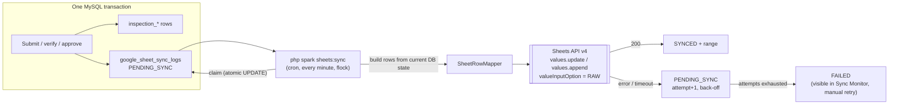

# 8. Google Sheets integration

## 8.1 Principles

1. **MySQL is the system of record. Google Sheets is a reporting copy.** Nothing in the plant waits for Google.
2. **Transactional outbox.** The sync job is inserted in the *same* transaction as the business change (submit, approve …). There is no window where a report exists without its job.
3. **Google is called only after commit**, by a background worker, and never inside a DB transaction.
4. **At-least-once delivery with de-duplication** gives effectively-once rows in the sheet.
5. **Least privilege.** A dedicated service account that can open exactly one spreadsheet (plus the detail spreadsheet, if one is used), with the Sheets scope only.



## 8.2 What is written where

| Tab | Rows | Write mode | Written when |
|---|---|---|---|
| `Reports` (main spreadsheet) | One per report **revision**, keyed by `report_no|R<rev>` | Upsert (update in place) | Every workflow event: submit, verify, return, reject, approve, cancel, supersede |
| `Observations_YYYY_MM` (detail spreadsheet) | One per **reading** of a final report | Append once (immutable) | QA approval or rejection: the data can no longer change |

Observation rows are written when the report is final. Until then readings can still change through a return for
correction, and updating rows in place inside a shared spreadsheet is fragile. The `Reports` row shows status,
result and OOS count in near real time from the moment of submission.

**`Reports` columns:** Sync Key · Report No · Revision · Report Type · Production Date · Shift · Part Number ·
Part Name · Machine · Operator · Setter · Status · Overall Result · OOS Readings · Accepted · Rejected · Rework ·
Expired Gauge Used · Submitted By · Submitted At · Production Verified By/At · Quality Verified By/At ·
QA Approved By/At · Template / Version · Format Doc No / Rev · QMS ID · Synced At.

**`Observations_YYYY_MM` columns:** Sync Key · Report No · Revision · Report Type · Production Date · Part Number ·
Machine · Shift · Round · Inspection Time · Section · Parameter Code · Parameter · Specification · LSL · USL · Unit ·
Method · Gauge ID · Gauge Calibration Valid · Reading No · Value · Result · Remarks.

`google.observation_detail` selects `ALL` (default), `OOS_ONLY` (failed readings only) or `NONE`.

## 8.3 Capacity planning (Google limit: 10 million cells per spreadsheet)

| Example plant (15 machines) | Rows / year | Cells / year |
|---|---|---|
| `Reports` (~32 columns) | ~27 000 | ~0.86 M → fits a single spreadsheet for about 10 years |
| Observations, `ALL` (~24 columns) | ~1.1 M | ~26 M → **one detail spreadsheet lasts ~3–4 months** |
| Observations, `OOS_ONLY` | ~1–3 % of readings | well under 1 M |

Built in:
- Observation tabs are monthly, inside a **separate detail spreadsheet** (`google.detail_spreadsheet_id`, empty = main).
- A **capacity guard** checks the grid size (`spreadsheets.get`). At `google.capacity_alert_percent` (80 %) it pauses detail jobs, which stay `PENDING_SYNC` so nothing is lost, and shows an alert. The admin creates a new detail spreadsheet, shares it with the service account and pastes its ID, and the queue continues.
- Every job records the `spreadsheet_id` it wrote to, so you can always tell where a report's rows went.
- The full detail is always available in the QMS itself (reports and CSV export).

## 8.4 Job lifecycle and worker algorithm

| Status | Meaning |
|---|---|
| `PENDING_SYNC` | Waiting, either new or for its next retry (`next_attempt_at`) |
| `PROCESSING` | Claimed by the worker (`locked_by`, `locked_at`). Reclaimed if older than 10 min (crashed worker) |
| `SYNCED` | Written; `sheet_range` and `synced_at` stored |
| `FAILED` | `google.max_attempts` reached. Shown in the Sync Monitor; **Retry** puts it back to `PENDING_SYNC` |

```text
sheets:sync --limit=40                       (cron: * * * * *  flock -n /run/qms/sync.lock php spark sheets:sync)
  stop if google.sync_enabled = 0
  reclaim PROCESSING jobs locked > 10 min
  repeat up to limit:
    pick oldest PENDING_SYNC with next_attempt_at <= now
    claim:  UPDATE … SET PROCESSING, locked_by, attempt_count+1, last_attempt_at
            WHERE id = ? AND sync_status = 'PENDING_SYNC'        -- 0 rows = someone else has it
    rows   := SheetRowMapper(job)            -- reads the CURRENT state, so coalesced events are safe
    target := resolve spreadsheet + tab; ensure tab exists (header, frozen row, protected range)
    capacity guard (detail jobs)
    REPORT_UPSERT:       find row (stored range → verify key cell, else search key column) → update, else append
    OBSERVATIONS_APPEND: if attempt > 1 and the key already exists in the tab → treat as done (de-dup), else append
    success → SYNCED (+ range, spreadsheet_id), clear error; older pending/failed upserts of the same report → SYNCED
    failure → attempt < max ? PENDING_SYNC with next_attempt_at = now + back-off : FAILED; error_message sanitised
    pause ≥ 1.1 s between writes (stays below 60 write requests/min per service account)
```

Enqueueing coalesces: if a `PENDING_SYNC` upsert already exists for the report, no second job is added, because the
worker always sends the latest state. The report row is locked during the transition, so this check is race-free.

### Back-off

`delay = min(2^(attempt-1) minutes, 6 h) ± 20 % jitter` →
1, 2, 4, 8, 16, 32, 64, 128, 256, 360, 360 minutes. With the default 12 attempts a job keeps retrying for about 20 hours
before it becomes `FAILED`. Data stays safe in MySQL regardless.

### Error handling

| Error | Handling |
|---|---|
| Timeout, connection reset, HTTP 5xx, 429 (quota) | Retry with back-off. An ambiguous outcome is covered by the de-dup check |
| 401 / 403 (key revoked, sheet not shared) | Retry with back-off, plus a **configuration alert** on the Sync Monitor and dashboard |
| 404 (spreadsheet not found) | Same as 403 |
| 400 "Unable to parse range" (tab missing / renamed) | Re-create the tab, retry once immediately |
| Capacity guard triggered | Job back to `PENDING_SYNC` (+1 h), alert. Does not count as an attempt |

## 8.5 Security of the integration

**Setup (one time, by the company's Google Workspace admin):**

1. Create a dedicated Google Cloud project (for example `qms-sheets-sync`) and enable **only** the Google Sheets API.
2. Create the service account `qms-sheets-writer` with **no IAM roles** on the project. It needs none to edit a sheet shared with it.
3. Create one JSON key. Transfer it over a secure channel and store it on the server as
   `/etc/qms/secrets/google-sa.json` (owner `root:qms`, mode `0440`). It stays **outside the project and web root**
   and never goes into Git, the database or a log.
4. Create the spreadsheet(s) in a company-owned Drive (not a personal account). Share **only** with the service-account
   e-mail as *Editor*, and with management as *Viewer*. Never "anyone with the link".
5. Protect the `Reports` and `Observations_*` tabs so only the service account can edit them. Analysts build pivots
   and charts in their own tabs or in another spreadsheet (`IMPORTRANGE`).
6. In QMS **Settings → Google**, enter the spreadsheet ID(s), switch sync on, press **Test connection** (reads the title only).

**Runtime controls:**

| Control | Implementation |
|---|---|
| Credential location | `.env` / PHP-FPM pool: `google.credentialsFile = /etc/qms/secrets/google-sa.json` (a path, never the key itself) |
| Scope | `https://www.googleapis.com/auth/spreadsheets` only. A service account can open only files shared with it, so the effective access is the configured spreadsheet(s) |
| Formula injection | `valueInputOption = RAW`: a reading or remark beginning with `=`, `+`, `-` or `@` is stored as text, never as a formula |
| Data minimisation | Inspection data plus employee name and code only (no phone or e-mail) |
| Network | Outbound HTTPS allowed only to `oauth2.googleapis.com` and `sheets.googleapis.com` |
| Logging | Job id, HTTP status and Google error reason. Access tokens, key material and request headers are never logged or stored in `error_message` |
| Key rotation | Yearly or immediately on staff change or suspected exposure: create new key → update file → disable old key → delete after 7 days |
| Library footprint | `google/apiclient` with only the Sheets service kept (`Google\Task\Composer::cleanup`) |

## 8.6 Monitoring

- Dashboard card **Pending Google Sync** = reports with jobs in `PENDING_SYNC`, `PROCESSING` or `FAILED`.
- **Admin → Sync Monitor** (`sync.view`): counts per status, age of the oldest pending job, last successful sync, last error, capacity of each spreadsheet. Failed jobs can be retried one by one or all at once (`sync.manage`, audited).
- The worker writes a heartbeat. If there has been no successful run for 15 minutes while jobs are pending, the monitor turns red.

## 8.7 Testing

- `SheetsClientInterface` has a `FakeSheetsClient`, so services and the worker are tested without network access.
- Scenarios: success; 503 → back-off; timeout after write → de-dup prevents a second row; max attempts → FAILED → requeue; tab missing → created; capacity guard; enqueue coalescing; credentials never present in `error_message`.
- An optional manual smoke test against a scratch spreadsheet (`php spark sheets:test`) runs before go-live.
