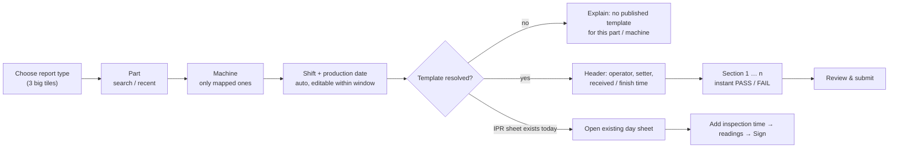

# 10. UI design and page list

## 10.1 Design principles (tablet first)

| Principle | Rule |
|---|---|
| Tablet is the primary device | Designed for 10" tablets (1280×800 landscape / 800×1280 portrait), then phones (≥ 360 px) and desktops |
| Touch | Touch targets ≥ 48 × 48 px, ≥ 8 px gaps (gloved hands), no hover-only actions, no tiny icon buttons |
| Data entry | Numeric fields use `inputmode="decimal"` (numeric keypad). Choices are big segmented buttons (OK / NOT OK, GO / NO GO), not dropdowns |
| Status never by colour alone | Every state = **colour + icon + text** (e.g. ✓ PASS, ✗ OUT OF SPEC) and also reads in black-and-white print |
| Calm, industrial | Neutral surfaces, one primary blue, no decorative animation (transitions ≤ 150 ms; `prefers-reduced-motion` respected) |
| Never lose work | Autosave, local draft, explicit "Saved 10:42" indicator, offline banner |
| Self-contained | Bootstrap 5.3, Bootstrap Icons and fonts served locally; works on an isolated plant network; strict CSP (no inline JS/CSS) |

## 10.2 Design tokens (`public/assets/css/qms.css`)

Style direction: *data-dense industrial dashboard* (blue data, amber highlights) adapted for the shop floor.
All text colours meet WCAG AA (≥ 4.5:1) on their background.

| Token | Value | Use |
|---|---|---|
| `--qms-primary` | `#1E40AF` | Primary buttons, links, active step (8.7:1 on white) |
| `--qms-primary-strong` | `#1E3A8A` | Hover/pressed, navbar |
| `--qms-bg` / `--qms-surface` | `#F8FAFC` / `#FFFFFF` | Page / cards |
| `--qms-border` | `#CBD5E1` | Inputs, tables |
| `--qms-text` / `--qms-muted` | `#0F172A` / `#475569` | Body / secondary text |
| `--qms-pass` (+ tint `#DCFCE7`) | `#15803D` | ✓ PASS |
| `--qms-fail` (+ tint `#FEE2E2`) | `#B91C1C` | ✗ FAIL / OUT OF SPEC (thick border on the field) |
| `--qms-pending` (+ tint `#FEF3C7`) | `#B45309` | ⏳ Pending, due-soon gauges, warnings |
| `--qms-approved` (+ tint `#DBEAFE`) | `#1D4ED8` | Approved seal |
| Font UI | Fira Sans (self-hosted, OFL) → `system-ui` fallback | 16 px base, 18 px on inputs |
| Font numbers | Fira Mono / `font-variant-numeric: tabular-nums` | Readings and limits line up in columns |
| Spacing / radius | 4 · 8 · 12 · 16 · 24 · 32 px / 8 px | Consistent rhythm |

### Status and result badges

| State | Colour | Icon (Bootstrap Icons) | Text |
|---|---|---|---|
| PASS | pass | `check-circle-fill` | PASS |
| FAIL | fail | `x-octagon-fill` | OUT OF SPEC |
| Incomplete | muted | `circle` | NOT FILLED |
| Draft | muted | `pencil-square` | DRAFT |
| Pending (any stage) | pending | `hourglass-split` | AWAITING PRODUCTION / QUALITY / QA |
| Returned | pending | `arrow-return-left` | RETURNED |
| QA Approved | approved | `patch-check-fill` | APPROVED |
| Rejected | fail | `slash-circle` | REJECTED |
| Cancelled / Superseded | muted | `x-circle` / `layers` | CANCELLED / SUPERSEDED |
| Gauge expired / due soon | fail / pending | `exclamation-triangle-fill` | CALIBRATION EXPIRED / DUE IN n DAYS |
| Sync | pending / pass / fail | `cloud-arrow-up` / `cloud-check` / `cloud-slash` | SYNC PENDING / SYNCED / SYNC FAILED |

## 10.3 Key components

- **App shell:** top bar with logo, current plant date and shift ("03-10-2026 · Shift B"), online/offline and sync indicator, approvals inbox badge, user menu with a large **Switch user** button. A left rail on tablet and desktop becomes a bottom bar on phones.
- **Sticky action bar** (bottom of entry screens): `◀ Previous` · `Save draft` · `Next ▶` · `Submit`, with progress "Section 2 of 4 · 9 / 14 filled" and "Saved 10:42".
- **Section stepper:** one chip per section showing completion and the number of OOS readings.
- **Reading field:** parameter name, spec line (`LSL 6.40 · USL 6.60 mm · DVC`), large input, and an instant result badge. Out of spec shows a red border, icon and text "6.65 > USL 6.60", and prompts for a remark.
- **Choice toggle:** `✓ OK` / `✗ NOT OK`, `GO` / `NO GO` as 56 px segmented buttons.
- **Gauge picker:** bottom sheet with gauges of the required type and their calibration badge. Expired gauges are disabled when blocking is on. Type-ahead by Gauge ID also works with keyboard-wedge barcode scanners.
- **IPR grid:** tabs for Shift A / B / C. Inside, a sticky parameter column and one column per inspection time. Tapping a cell opens a large input. Each column footer has lot status, accepted / rejected / rework, **Sign** (operator) and **Verify** (QE).
- **Offline banner:** "Offline – 3 changes saved on this tablet. They will be sent automatically when the connection returns." Submit is disabled while offline, with that reason shown.
- **Signature dialog:** meaning of the signature ("You are approving SCA-2026-10-000123 as Quality Engineer"), remarks, password.

## 10.4 Page list

| # | Page | Route | Access | Key elements |
|---|---|---|---|---|
| **Authentication** | | | | |
| 1 | Login | `/login` | public | Username, password (show toggle), generic error, lockout message, company logo |
| 2 | Change password | `/account/password` | logged in (forced when required) | Policy checklist that updates as you type |
| 3 | Session expired | `/session-expired` | public | Re-login; local draft is kept |
| **Home** | | | | |
| 4 | Management dashboard | `/dashboard` | `dashboard.view` | Filters (date, month, part, machine, shift, operator, status); cards: Total today, Passed, Failed, Pending approval, Out of spec, Pending Google sync; trend chart; pending > 24 h list |
| 5 | Operator home | `/` (operators) | `inspection.create` | Three big tiles (SCA / PPI / IPR), "Continue draft", "Today's IPR sheets", "Returned to me" |
| **Inspections** | | | | |
| 6 | New inspection wizard | `/inspections/new` | `inspection.create` | Report type → part (search, recent) → machine (filtered by mapping) → shift (auto) → template auto-loaded |
| 7 | Inspection entry (SCA, PPI) | `/inspections/{id}/edit` | creator | Header block, section stepper, reading fields, gauge picker, sticky action bar, autosave |
| 8 | IPR day sheet | `/inspections/{id}/edit` | shift operators | Shift tabs, time columns, add inspection time, sign / verify round, lot status per round |
| 9 | Review & submit | `/inspections/{id}/review` | creator | Summary: OOS readings, missing values, expired gauges; confirm submit |
| 10 | Inspection list | `/inspections` | `view_own` / `view_all` | Filters, status and result badges, sync badge, quick print |
| 11 | Inspection detail | `/inspections/{id}` | viewers of the record | Read-only report, signature timeline, revisions, audit excerpt |
| 12 | Create revision | `/inspections/{id}/revise` | `inspection.revise` | Reason (required), copy confirmation |
| **Approvals** | | | | |
| 13 | Approval inbox | `/approvals` | any verify / approve permission | Tabs per stage, oldest first, OOS highlighted |
| 14 | Review & sign | `/approvals/{id}` | stage permission | Full report, Approve / Return / Reject → signature dialog |
| **Printing** | | | | |
| 15 | Print preview (A4) | `/inspections/{id}/print` | `inspection.print` | Print button, PDF download, watermark for non-final |
| **Templates** | | | | |
| 16 | Template list | `/templates` | `template.view` | Code, version, status, report type, mapped parts and machines |
| 17 | Template editor | `/templates/{id}/edit` | `template.manage` | Format document control, sections (drag order), parameter table, type-dependent fields |
| 18 | Parameter dialog | (modal) | `template.manage` | Library pick, type, unit, nominal, LSL, USL, decimals, method, gauge type, Gauge ID required, observations, mandatory, pre-fill |
| 19 | Mapping | `/templates/{id}/mapping` | `template.manage` | Parts and machines, conflict warnings |
| 20 | Preview / publish | `/templates/{id}/preview` | `template.publish` | Renders the live form and the print; publish / retire / new version |
| **Master data** | | | | |
| 21–29 | Machines · Parts · Shifts · Employees · Departments · Units · Inspection methods · Gauge types · Parameter library | `/masters/...` | `master.*` | List + form, activate / retire, immutable codes |
| **Gauges** | | | | |
| 30 | Gauge list | `/gauges` | `gauge.view` | Calibration status badges, due filter |
| 31 | Gauge detail + calibration history | `/gauges/{id}` | `gauge.view` / `gauge.calibrate` | Record calibration, upload certificate, "where used since last calibration" |
| **Reports** | | | | |
| 32 | Daily report | `/reports/daily` | `report.view` | Per type, machine and result; print / CSV |
| 33 | Monthly report | `/reports/monthly` | `report.view` | Day-by-day totals, pass rate, OOS |
| 34 | Machine-wise | `/reports/machine` | `report.view` | Inspections, failures, OOS per machine |
| 35 | Part-wise | `/reports/part` | `report.view` | Per part and parameter |
| 36 | Operator-wise | `/reports/operator` | `report.view` | Inspections and OOS per operator |
| 37 | Rejection report | `/reports/rejection` | `report.view` | Accepted / rejected / rework quantities |
| 38 | Out-of-specification report | `/reports/oos` | `report.view` | Every failed reading with spec, value, gauge, report link |
| 39 | Gauge calibration due | `/reports/gauge-due` | `report.view` | Overdue / due within n days |
| **Administration** | | | | |
| 40 | Users | `/admin/users` | `user.manage` | Create, reset password, unlock, disable |
| 41 | Roles & permission matrix | `/admin/roles` | `role.manage` | Grid of permissions per role, grouped by module |
| 42 | Audit trail | `/admin/audit` | `audit.view` | Filters, before/after diff view, export |
| 43 | Login history | `/admin/login-logs` | `loginlog.view` | Events, IP, user agent |
| 44 | Google Sync Monitor | `/admin/sync` | `sync.view` | Status counts, oldest pending, errors, capacity, retry |
| 45 | System settings | `/admin/settings` | `setting.manage` | Tabs: Company & logo · Documents & numbering · Regional · Google · Workflow · Security · Gauges · Inspection |
| **System** | | | | |
| 46 | Error pages | – | – | 403, 404, 409 (changed by someone else), 419 (form expired), 429, 500 with reference ID |

## 10.5 Inspection entry flow



Autosave and offline behaviour:
- Every change is saved to local storage at once (`qms:draft:<user>:<client_uuid>`) and sent to the server on field blur and every 20 s (setting). Only changed cells are sent, with `lock_version`.
- Offline: changes queue locally and the banner shows the count. When the connection returns they are replayed in order with idempotency keys. Submit is available only online.
- A 409 from the server means someone else changed the header. The screen offers "reload theirs" or "keep mine" per field.
- An expired session opens a login dialog over the form. The local draft is untouched and sync resumes after login.
- Local drafts are scoped to the user, removed after a confirmed server save, and flagged after 72 h.

## 10.6 Print layouts (A4)

```text
┌────────────────────────────────────────────────────────────────────────────────────────────────────────┐
│ [LOGO]  COMPANY NAME PVT. LTD.                                         │ Doc No   : QA/F/01            │
│         Plot ..., Industrial Area, Bhiwadi                             │ Rev No   : 02                 │
│                                                                        │ Make Dt  : 01-01-2024         │
│                    SETUP CHANGE APPROVAL                               │ Rev Dt   : 05-06-2026         │
├────────────────────────────────────────────────────────────────────────────────────────────────────────┤
│ Report No : SCA-2026-10-000123  Rev 0   Date : 03-10-2026   Shift : B                                  │
│ Part      : BF-1001 Brass Fitting 3/4"   Machine : CNC-01      Received : 14:20                        │
│ Operator  : E1001 Demo Operator          Setter  : E1002       Finish   : 14:55                        │
├────┬──────────────────────────┬───────┬───────┬─────────┬────────┬────────┬────────┬────────┬──────────┤
│ Sr │ Parameter                │ LSL   │ USL   │ Method  │ Gauge  │ Obs 1  │ Obs 2  │ Result │ Remarks  │
├────┼──────────────────────────┼───────┼───────┼─────────┼────────┼────────┼────────┼────────┼──────────┤
│    │ OPERATOR READINESS       │       │       │         │        │        │        │        │          │
│ 1  │ Skill Level              │ 3     │ 4     │ RECORD  │ -      │ 3      │ -      │ PASS   │          │
│    │ PROCESS PARAMETERS       │       │       │         │        │        │        │        │          │
│ 10 │ Machine Chuck Pressure   │ 18.0  │ 25.0  │ MEASURE │ PG-01  │ 21.5   │ 21.0   │ PASS   │          │
│    │ OTHER PARAMETERS         │       │       │         │        │        │        │        │          │
│ 14 │ Avg Wt After Machining g │ 320.0 │ 340.0 │ MEASURE │ WS-01  │ 333.0  │ *345.0 │ FAIL   │ Re-set   │
├────┴──────────────────────────┴───────┴───────┴─────────┴────────┴────────┴────────┴────────┴──────────┤
│ Operator                │ Production Engineer     │ Quality Engineer        │ QA Approval              │
│ name, date/time         │ name, date/time         │ name, date/time         │ name, date/time          │
│ (e-signed)              │ (e-signed)              │ (e-signed)              │ (e-signed)               │
├────────────────────────────────────────────────────────────────────────────────────────────────────────┤
│ Printed by ... on 03-10-2026 15:10   Page 1 of 1   Electronic record generated by QMS                  │
└────────────────────────────────────────────────────────────────────────────────────────────────────────┘
```

| Report | Orientation | Body |
|---|---|---|
| SCA (SECTIONED) | Portrait | Section bands, Obs 1 / Obs 2 |
| PPI (METHOD_MATRIX) | Portrait | Tick columns `GO/NO GO · VISUAL · TPG · DVC` from the template's methods, Gauge ID, Obs 1 / Obs 2, approvals block (Operator, Production Engineer, Quality Engineer, QA) |
| IPR (SHIFT_GRID) | Landscape | Parameter + spec columns, then Shift A / B / C groups with one column per inspection time; footer rows: Lot Status, Accepted, Rejected, Rework, Inspected By Operator, Inspected By QE. A long day splits across pages with repeated headers |

Print CSS: `@page { size: A4; margin: 10mm }`, `thead { display: table-header-group }`, `tr { break-inside: avoid }`.
Navigation, buttons and banners are hidden. Out-of-spec values are bold, marked `*` and ✗ (black-and-white safe).
Non-final reports carry a diagonal **DRAFT** / **SUBMITTED – NOT APPROVED** / **SUPERSEDED** / **CANCELLED**
watermark. The server-side PDF (mPDF) uses the same template with running headers and page numbers.

## 10.7 Accessibility checklist

- Labels bound to every input (`<label for>`), error text next to the field and in `aria-describedby`.
- Visible focus ring (3 px, primary colour); tab order follows the visual order.
- Contrast ≥ 4.5:1 for text and ≥ 3:1 for field borders and icons.
- Result changes announced politely (`aria-live="polite"`) for screen readers.
- Text up to 200 % zoom without horizontal scrolling (except the IPR grid, which scrolls inside its own container).
- No information conveyed by colour alone; icons have text equivalents.
